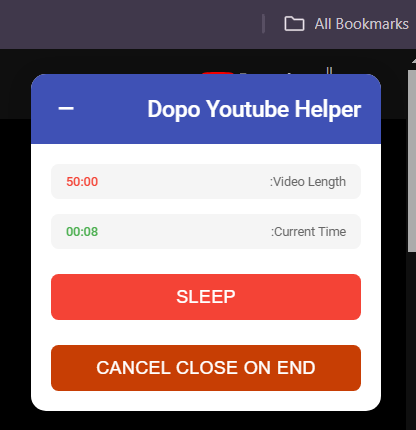

# Dopo Youtube Helper

**Dopo Youtube Helper** is a Chrome extension that enhances the YouTube viewing experience by displaying video duration and current time, allowing users to automatically close the tab when the video ends, and providing a user-friendly interface with toggle options for added functionality.

 
## Features

- **Video Duration Display**: Shows the total length of the video.
- **Current Time Display**: Displays the current playback time of the video.
- **Close Tab on Video Ends**: Automatically closes the tab when the video finishes playing.
- **Toggle UI Visibility**: Easily hide or show the extension's UI.

## Installation

1. Clone this repository:
   ```bash
   git clone https://github.com/yourusername/dopo-youtube-helper.git
   cd dopo-youtube-helper

2. Load the extension in Chrome:

   - Open the Chrome browser and navigate to chrome://extensions/
   - Enable "Developer mode" by toggling the switch in the top right corner
   - Click on "Load unpacked" button
   - Select the directory where you saved your extension files
   - The extension should now appear in your list of installed extensions

3. Test the extension:

   - Navigate to a YouTube video page
   - You should see the Dopo Youtube Helper UI appear in the top right corner of the page
   - The UI will display the video duration and current time
   - You can toggle the "Close Tab On Video Ends" feature
   - The UI can be minimized by clicking the toggle button in the header

4. Debugging:

   - If you encounter any issues, check the Chrome console for error messages
   - You can reload the extension by clicking the refresh icon on the chrome://extensions/ page
   - For more detailed debugging, click on "background page" under your extension on the chrome://extensions/ page to open the developer tools for the background script

5. Making changes:

   - If you make changes to your extension code, you'll need to reload the extension
   - Go to chrome://extensions/
   - Find your extension and click the refresh icon
   - If you've made changes to the manifest.json file, you may need to remove and re-add the extension
